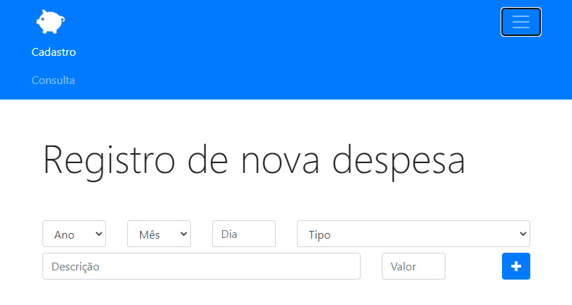
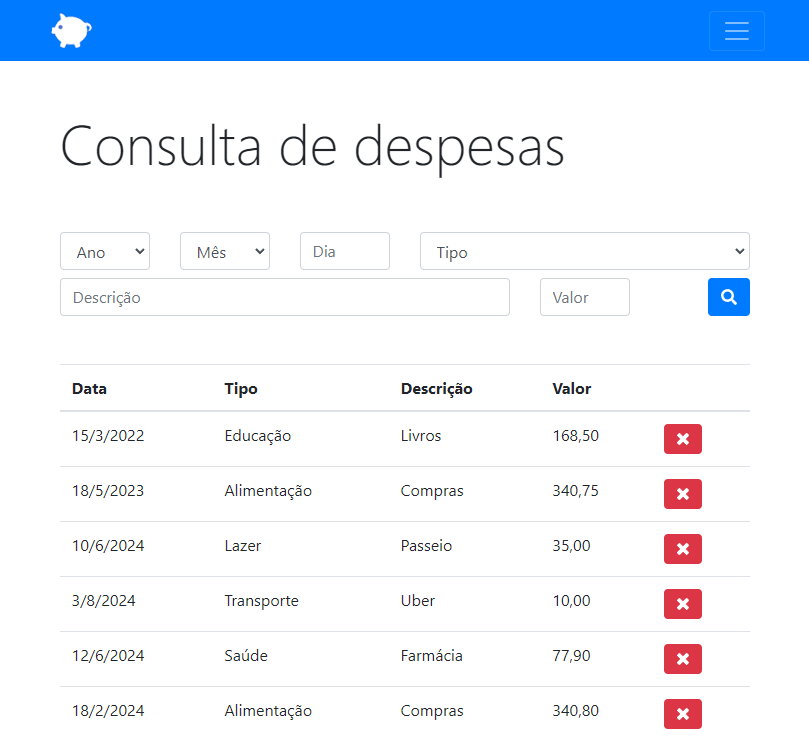

# Orcamento pessoal

Curso online:

Domine Web - 20 Cursos - HTML5, CSS3, SASS, Bootstrap, JS, ES6, PHP, MySQL, JQuery, MVC, APIs, IONIC e muito mais

Autores:
Jorge Sant Ana e Jamilton Damasceno

Construção de um site para cadastros de despesas utilizando HTML5, CSS, Bootstrap 4, Javascript e persistência com LocalStorage. 

>Figura 1: Cadastro de despesa

 
>Figura 2: Consulta de despesas

 
 
